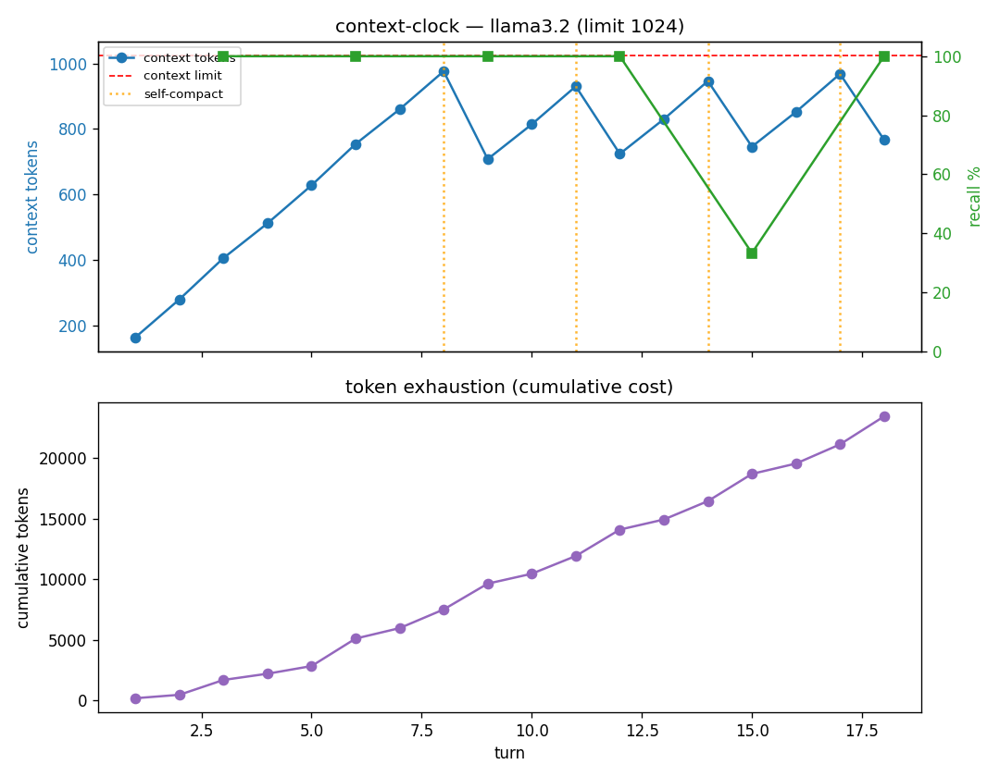

# context-clock — findings report

**Date:** 2026-05-24
**Model:** `llama3.2` (3B), local via Ollama — zero API cost
**Config:** context limit (`num_ctx`) = 1024 · 18 turns · probe every 3 turns · compaction threshold 0.85
**Reproduce:**
```bash
ollama pull llama3.2
python -m context_clock.run --model llama3.2 --turns 18 --limit 1024 --cadence 3 --threshold 0.85
```

## What this measures

A long-running session on a finite context window, with no external memory. Each turn
injects a uniquely-answerable fact ("Memo N: the vault code is kNNN"); every 3 turns we
probe recall of the oldest facts; when the live context fills past 85% of the window, the
agent **self-compacts** (lossily summarizes the oldest turns). We record, per turn, the
live context size, cumulative tokens spent, recall, and compaction events.

## Result



All four stages of context-window failure appear, measured:

| Stage | Evidence |
|---|---|
| **1. Context fills** | live context climbs 164 → 976 tokens, right to the 1024 limit |
| **2. Recall decays** | recall on the oldest facts drops from 100% to **33%** (turn 15) |
| **3. Tokens exhaust** | cumulative spend climbs to **~23,400 tokens** over 18 turns |
| **4. Self-compaction fires** | triggered at turns 8, 11, 14, 17 — the sawtooth in the context curve |

Note that compaction is not free: each event adds a summarization call, visible as the
steeper jumps in the cumulative-token curve. It buys headroom by **discarding detail** —
which is the recall cost.

## Honest caveats

- **Recall is noisy, not monotonic** (33% at turn 15, back to 100% at 18). v1 probes only
  the 3 oldest facts, and lossy compaction sometimes retains a code by chance. A cleaner
  decay curve needs: more probed facts, a smaller limit, or more turns. The harness is
  sound; the signal-to-noise is a v1 tuning matter.
- **Single small model.** This is one 3B model at a 1024 cap. Results demonstrate the
  *phenomenon* and validate the harness — they are **not** a frontier-model claim.
- **Not 1:1 across models.** The arc *shape* reproduces everywhere, but onset/steepness/scale
  are model-specific (Chroma "Context Rot" found degradation is non-uniform). Each target
  model must be re-run.

## Cross-model comparison (same 1024 window, vary model)

Holding the window + workload fixed and varying only the model:

| Model | Compactions | Total tokens | Min recall |
|---|---|---|---|
| llama3.2 (3B) | 4 | 23,449 | **33%** |
| qwen2.5 (14B) | 4 | 22,934 | **100%** |
| phi4 (14B) | 4 | 23,525 | **100%** |

At the same window, all three fill and compact **identically** — the window is the
constraint, not the model. The only difference is **recall robustness to lossy compaction**:
the 3B model loses codes when old turns are summarized; the 14B models retain them.
Same harness, same arc, model-specific recall — degradation is *non-uniform across models*.

## Window-size sweep (llama3.2, vary the window) — "a bigger window is a trap"

| Window | Tokens before 1st compaction | Total tokens | Rot onset |
|---|---|---|---|
| 1024 | 7,500 | 23,449 | turn ~15 |
| 2048 | 21,449 | 44,908 | turn ~24 |
| 4096 | **82,048** | **136,813** | turn ~35 |

Two measured truths: (1) **token consumption scales super-linearly with window size**
(≈11× more tokens burned before forced compaction from 1024→4096); (2) **bigger windows
delay the recall cliff but never escape it** — every window decays to the same 33% floor.
More room buys *time*, not *reliability*, at dramatically higher cost — the case for an
external memory layer rather than a bigger context.

## The payoff: memory backend vs full-context (llama3.2, 18 turns)

Same workload, but a memory backend retrieves only the relevant fact per probe
instead of stacking the whole transcript:

| | Full-context (ctx 1024) | Memory backend |
|---|---|---|
| Live context | climbs to 976 | **flat at 167** |
| Cumulative tokens | 23,449 | **3,060** (≈7.7× fewer) |
| Compactions | 4 | **0** |
| Recall | drops to 33% | **100%** |

Retrieve-what's-needed stays flat and never forgets; stuff-everything explodes and rots.
(The v1 backend is an exact-key retriever — the ideal-retrieval reference. Real backends
— Attestor / Zep / Mem0 — implement the same `add` / `recall` interface and slot in here,
where the interesting question becomes how well *semantic* retrieval holds up.)

## Status

v1 complete: 38 tests green (compaction, grader, meter, driver helpers, retrieval memory
test-first; provider + end-to-end validated by real runs). 100% local, reproducible with
Ollama only.

## Next

- Tune for a cleaner decay curve (more probes / smaller limit / longer run).
- `--no-compaction` naive baseline for contrast (overflow without intervention).
- Multi-model sweep (`qwen2.5:14b`, `phi4:14b`) to show the non-1:1 profiles.
- Later: plug in a memory backend (Attestor / Zep) to show the arc flattening.
