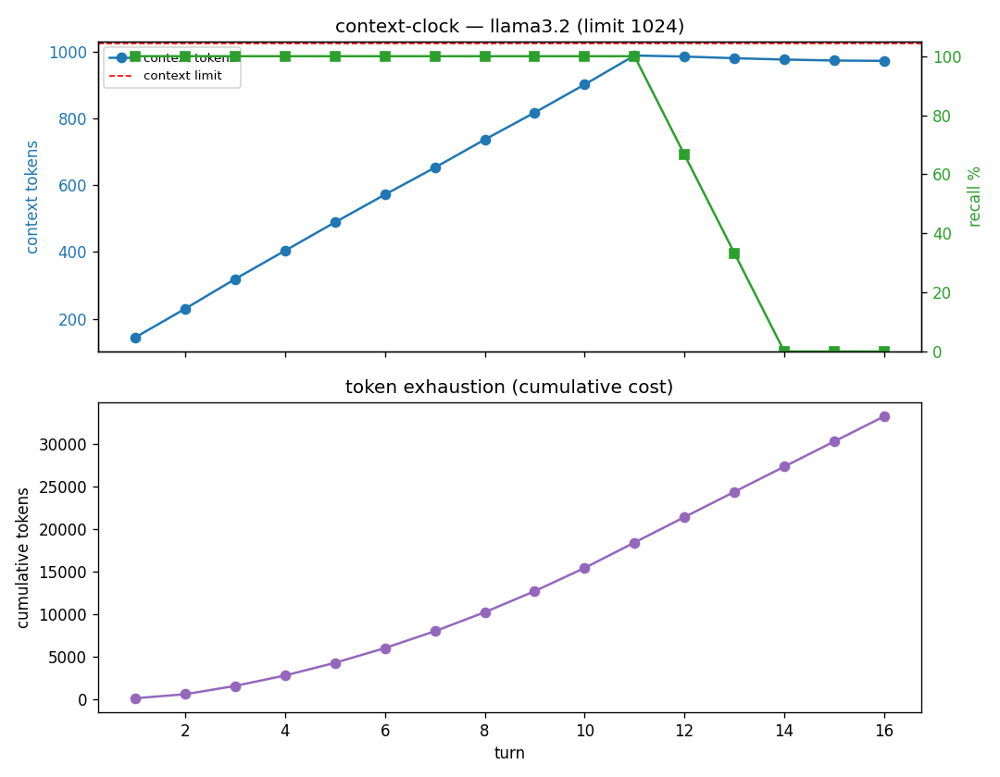
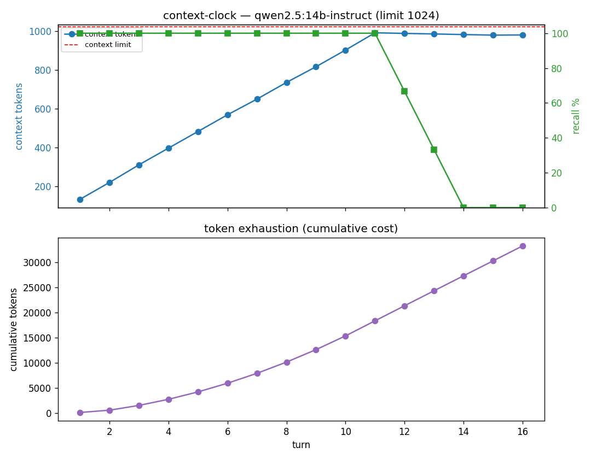
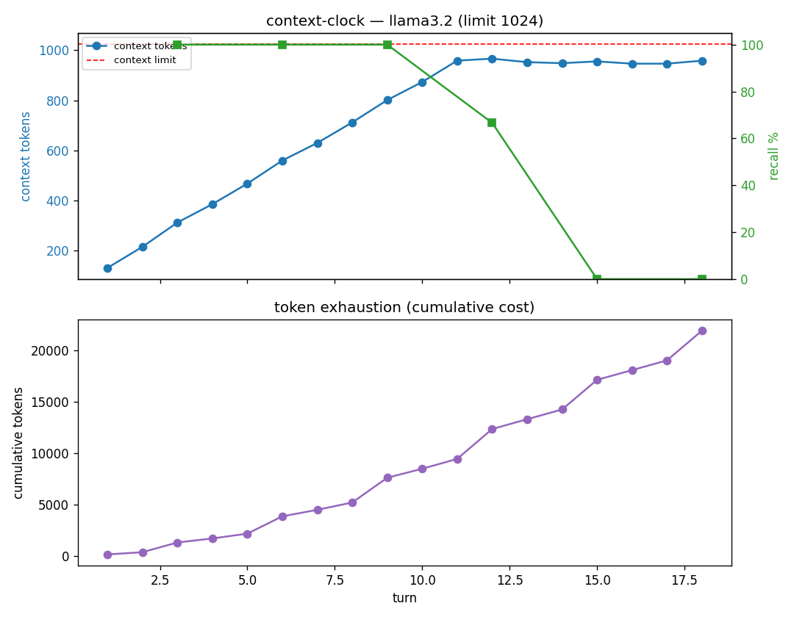

# context-clock — findings report

**Date:** 2026-05-24
**Model:** `llama3.2` (3B), local via Ollama — zero API cost
**Config:** context limit (`num_ctx`) = 1024 · 18 turns · probe every 3 turns · compaction threshold 0.85
**Reproduce:**
```bash
ollama pull llama3.2
# headline: rot until complete — no compaction, probe every turn, stop at full rot
python -m context_clock.run --model llama3.2 --until-rotted --limit 1024 --turns 60
# agent-compaction intervention, for contrast
python -m context_clock.run --model llama3.2 --turns 18 --limit 1024 --cadence 3 --threshold 0.85
```

## What this measures

A long-running session on a finite context window, with no external memory. Each turn
injects a uniquely-answerable fact — a varied NIAH-style haystack (see `documents.py`) with
the needle "Memo N: … the vault code is <code> …" buried in the middle, where the code is
deterministic per memo but **unpredictable** (e.g. `k44cb6`) so it can't be inferred; every 3 turns we
probe recall of the oldest facts; when the live context fills past 85% of the window, the
agent **self-compacts** (lossily summarizes the oldest turns). We record, per turn, the
live context size, cumulative tokens spent, recall, and compaction events.

## The core measurement: rot until complete (no intervention)

Keep adding a document every turn and probe recall **every turn**, with **no compaction**
— nothing is invoked, the model is on its own. We run until it's **fully rotted** (recall
pinned at 0% for 3 straight probes), not to a fixed turn count.



| Turn | 1–11 | 12 | 13 | 14 | 15 | 16 |
|---|---|---|---|---|---|---|
| Recall (oldest 3) | 100% | 67% | 33% | **0%** | **0%** | **0%** |

llama3.2, ctx 1024. Accuracy holds at 100% while everything still fits, then **collapses
over three turns** (100 → 67 → 33 → 0) as the prompt overflows the window and the oldest
memos are truncated away — and stays at 0%. The run **ends itself at turn 16** on sustained
zero. This is raw context rot with nothing intervening, and the accuracy drop is exactly the
signal we track.

> **Models don't self-compact.** A raw LLM never summarizes its own history — when the prompt
> exceeds the context window it simply **truncates** (drops the oldest tokens). The compaction
> and memory sections below are *agent-layer interventions* we invoke on top of the model, not
> behaviors the model exhibits on its own.

## Cross-model rot is model-independent (once the needle can't be guessed)

The first cross-model attempt used a *deterministic* needle (`Memo N → k{N:03d}`). Under that,
qwen2.5:14b appeared to resist rot far longer than llama3.2 — full rot at turn 27 vs 16, even
*recovering* to 100% at turns where it could no longer hold the oldest memos. That was a
**confound, not robustness**: both models truncate at the same ~980-token window, so by turn 16
memos 1–3 are gone from context — qwen was *inferring* the codes from the pattern in the visible
recent memos, not recalling them. A 14B model spots that pattern; a 3B model doesn't.

**Fix:** the needle is now a deterministic-but-**unpredictable** code (e.g. `k44cb6`), so it
can't be reconstructed from the index — the only way to answer is to actually have the fact in
context. Re-running with unpredictable needles (ctx 1024, no compaction, probe every turn):



| Model | Size | Recall trajectory | Fully rotted |
|---|---|---|---|
| llama3.2 | 3B | 100% (t1–11) → 67 → 33 → 0 | turn **16** |
| qwen2.5 | 14B | 100% (t1–11) → 67 → 33 → 0 | turn **16** |
| phi4 | 14B | 100% (t1–11) → 67 → 33 → 0 | turn **16** |
| mistral-small | 24B | 100% (t1–11) → 67 → 33 → 0 | turn **16** |

**Identical across all four.** Across an **8× parameter spread (3B → 24B)** and three model families,
once the answer can't be guessed every model rots at exactly the same turn, on the same curve.
**Raw context rot is model-independent** — truncation drops the oldest tokens regardless of model
capacity or family. (Contrast the *compaction* experiment below, where model size genuinely matters
for recall robustness to lossy summaries — a different question.)

> **Local ceiling:** `qwq:32b` (a 32B *reasoning* model) was attempted but exceeded a 600s
> per-call timeout on this hardware before completing a turn — its long `<think>` traces make
> it intractable locally (and would also confound a 16-token probe). The practical local ceiling
> here is ~24B; bigger models need the API/native-window path.

**Per-turn token usage** (`turn_tokens`, `prompt_tokens`, `completion_tokens`) is recorded each
turn in the CSV and printed live; the per-turn cost plateaus at ~2.96K tokens once the window
saturates (3 probes × a ~980-token prompt).

## Agent intervention: self-compaction (vs the raw rot above)


All four stages of context-window failure appear, measured:

| Stage | Evidence |
|---|---|
| **1. Context fills** | live context climbs 164 → 976 tokens, right to the 1024 limit |
| **2. Recall decays** | recall on the oldest facts drops from 100% to **33%** (turn 15) |
| **3. Tokens exhaust** | cumulative spend climbs to **~23,400 tokens** over 18 turns |
| **4. Self-compaction fires** | triggered at turns 8, 11, 14, 17 — the sawtooth in the context curve |

Note that compaction is not free: each event adds a summarization call, visible as the
steeper jumps in the cumulative-token curve. It buys headroom by **discarding detail** —
which is the recall cost.

## Honest caveats

- **Recall is noisy under compaction, not monotonic** (33% at turn 15, back to 100% at 18).
  v1 probes only the 3 oldest facts, and lossy compaction sometimes retains a code by chance.
  The naive `--no-compaction` baseline (below) gives the clean monotonic decay — so the noise
  is a compaction-plus-tuning artifact, not a harness flaw.
- **Single small model.** This is one 3B model at a 1024 cap. Results demonstrate the
  *phenomenon* and validate the harness — they are **not** a frontier-model claim.
- **Not 1:1 across models.** The arc *shape* reproduces everywhere, but onset/steepness/scale
  are model-specific (Chroma "Context Rot" found degradation is non-uniform). Each target
  model must be re-run.

## Cross-model comparison (same 1024 window, vary model)

Holding the window + workload fixed and varying only the model:

| Model | Compactions | Total tokens | Min recall |
|---|---|---|---|
| llama3.2 (3B) | 4 | 23,449 | **33%** |
| qwen2.5 (14B) | 4 | 22,934 | **100%** |
| phi4 (14B) | 4 | 23,525 | **100%** |

At the same window, all three fill and compact **identically** — the window is the
constraint, not the model. The only difference is **recall robustness to lossy compaction**:
the 3B model loses codes when old turns are summarized; the 14B models retain them.
Same harness, same arc, model-specific recall — degradation is *non-uniform across models*.

## Window-size sweep (llama3.2, vary the window) — "a bigger window is a trap"

| Window | Tokens before 1st compaction | Total tokens | Rot onset |
|---|---|---|---|
| 1024 | 7,500 | 23,449 | turn ~15 |
| 2048 | 21,449 | 44,908 | turn ~24 |
| 4096 | **82,048** | **136,813** | turn ~35 |

Two measured truths: (1) **token consumption scales super-linearly with window size**
(≈11× more tokens burned before forced compaction from 1024→4096); (2) **bigger windows
delay the recall cliff but never escape it** — every window decays to the same 33% floor.
More room buys *time*, not *reliability*, at dramatically higher cost — the case for an
external memory layer rather than a bigger context.

## The payoff: memory backend vs full-context (llama3.2, 18 turns)

Same workload, but a memory backend retrieves only the relevant fact per probe
instead of stacking the whole transcript:

| | Full-context (ctx 1024) | Memory backend |
|---|---|---|
| Live context | climbs to 976 | **flat at 167** |
| Cumulative tokens | 23,449 | **3,060** (≈7.7× fewer) |
| Compactions | 4 | **0** |
| Recall | drops to 33% | **100%** |

Retrieve-what's-needed stays flat and never forgets; stuff-everything explodes and rots.
(The v1 backend is an exact-key retriever — the ideal-retrieval reference. Real backends
— Attestor / Zep / Mem0 — implement the same `add` / `recall` interface and slot in here,
where the interesting question becomes how well *semantic* retrieval holds up.)

## Naive baseline: no compaction (llama3.2, ctx 1024, 18 turns)

Same workload with `--no-compaction` — let the window overflow, never reclaim headroom:



| Turn | 3 | 6 | 9 | 12 | 15 | 18 |
|---|---|---|---|---|---|---|
| Recall (oldest 3) | 100% | 100% | 100% | 67% | **0%** | **0%** |

Live context climbs to ~958 then **plateaus at the 1024 cap**: the model only ever sees the
last ~1024 tokens, so the oldest memos are silently truncated and recall of them **decays
cleanly to 0%**. This is the clearest "context rot" curve in the project — with no compaction
there's no sawtooth, the window just slides forward and forgets. (The compaction run above is
noisy *because* lossy summaries sometimes keep a code by chance.)

## Native-window feasibility (local, single timed call)

Is a native-size window runnable locally at all? `documents.py` exists to fill them — a varied
haystack reaches native scale in a few turns. Measured on llama3.2 (3B):

| Window | Prompt tokens | Latency | Needle found |
|---|---|---|---|
| 8K | 5,397 | 11.2s | ✓ |
| 16K | 11,767 | 29.4s | ✓ |

≈2.5 ms/token. **Viable** on a small model at ≤16K with `--timeout` raised. The earlier
16K/32K/128K sweep timed out only because it combined a **14B–32B model × a large window ×
the 120s cap** — not an inherent wall. ≥32K or 14B+ models stay impractical locally.

## Status

v1 complete: 57 tests green (compaction, grader, meter, driver helpers, retrieval memory, NIAH documents, unpredictable needles, rot-until-complete stop logic, per-turn token usage
test-first; provider + end-to-end validated by real runs). 100% local, reproducible with
Ollama only.

## Next

- ✅ Unpredictable needles (done — codes are deterministic per memo but not index-derivable, so recall can't be faked by inference).
- ✅ Rot-until-complete stress mode (done — `--until-rotted`; the headline measurement above).
- ✅ `--no-compaction` naive baseline (done — see above; gives the clean decay curve).
- ✅ Varied NIAH haystacks (done — `documents.py`, wired into the driver).
- Run a full native-window arc (llama3.2, 8K–16K, raised `--timeout`), now that per-call
  latency is known to be tractable.
- Multi-model sweep (`qwen2.5:14b`, `phi4:14b`) to show the non-1:1 profiles.
- Later: plug in a memory backend (Attestor / Zep) to show the arc flattening.
